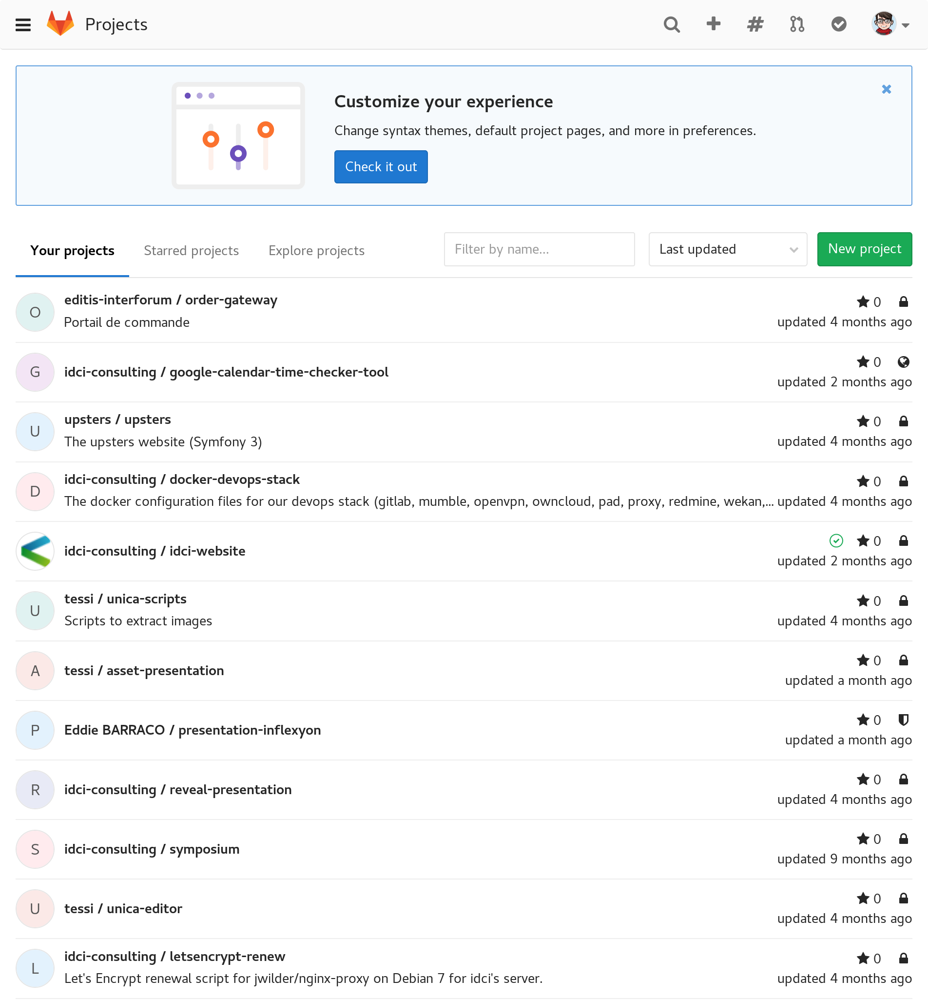
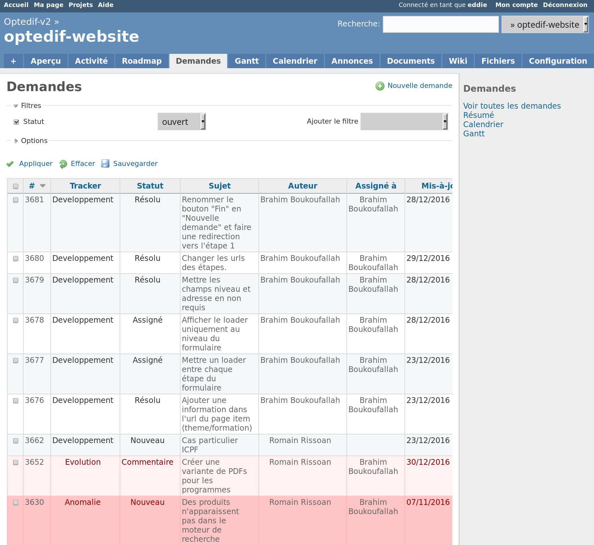
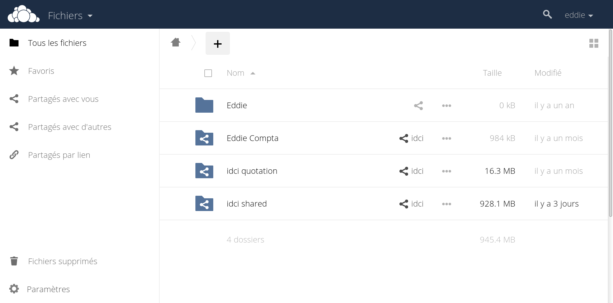
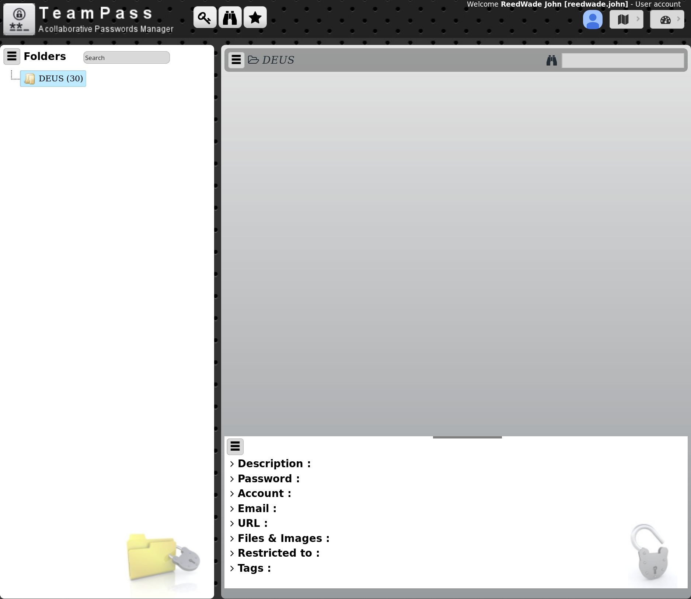
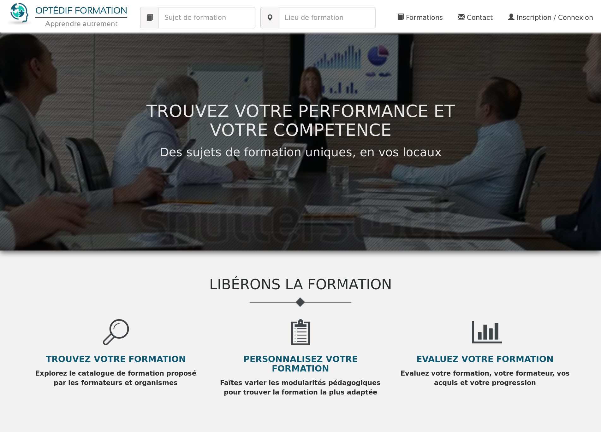
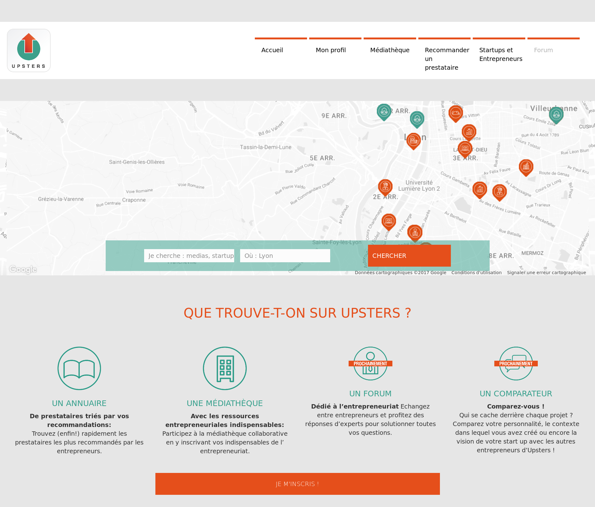

# Remerciements

Je tiens à remercier dans un premier temps, toute l'équipe pédagogique de l'IUT informatique de Bourg-en-Bresse et les intervenants professionnels de la formation METINET, pour nous avoir transmis leurs expériences.

Je tiens à remercier toute l'équipe d'IDCI-Consulting pour l'accompagnement qu'elle m'a apporté depuis déjà plus d'un an.
Je remercie plus particulièrement Brahim Boukoufallah pour sa disponibilité et l'attention qu'il m'a consacrée jusqu'à aujourd'hui, ainsi que Baptiste Bouchereau et Gabriel Bondaz pour toute l'expérience dont ils m'ont fait profiter.

Je remercie également Adrien Peytavie pour son accompagnement depuis mon stage en DUT jusqu'à cette année METINET.

# Résumé

Un développeur full-stack maîtrise l'ensemble des domaines techniques constitutifs d'un projet informatique : administration système et hébergement, modèles de données, logique métier, interface utilisateur (avec l'aide d'un graphiste), expérience utilisateur (UX), recueil et compréhension des besoins.

La licence professionnelle METINET se porte plus précisément sur les technologies web et comprend un apprentissage des différents processus de la conception jusqu'aux développements.

Cette licence est basée sur une alternance de période de cours et d'entreprise. C'est grâce à ces dernières que les étudiants ont la possibilité de gagner rapidement une solide expérience professionnelle. J'ai dont eu la chance d'avoir un aperçu de mon futur métier lors de mon implication sur les différents projets au sein de mon entreprise IDCI-Consulting.

# Sommaire

# Introduction

IDCI-Consulting est une entreprise de services du numérique (ou ESN). Au cours de cette année, plusieurs missions m'ont été confiées.

Ce rapport présente tout d'abord l'entreprise et mon environnement de travail, et rend compte du développement des différentes missions par un descriptif de celles-ci suivi d'une étude fonctionnelle et technologique.

Il se conclura par les évolutions futures des projets et par un bilan sur la globalité de ma formation.

## IDCI-Consulting

IDCI-Consulting est une ESN au capital de 10 000 €, créée le 10 décembre 2007 à l'initiative de Gabriel Bondaz et Frédéric Bondaz. L'activité principale consiste en la conception, le développement et le maintien de sites web s'appuyant sur des technologies open source : il s'agit généralement d'applications web PHP complexes telles que des solutions e-commerce, de la gestion d'événements, d'outils internes à d'autres entreprises, etc.

En plus du développement, IDCI-Consulting propose des formations dans le domaine du web. Cela peut être pour ses clients afin de leur permettre de prendre en main leur site, ou pour d'autres entreprises soucieuses de découvrir des technologies de pointe. Enfin, IDCI-Consulting propose aux entreprises des consultants qui apportent à ces dernières un support et des compétences d'experts.

## Environnement de travail

La SARL IDCI-Consulting est une petite structure se composant (moi inclus) de cinq collaborateurs : Gabriel Bondaz (gérant/analyste développeur), Frédéric Bondaz (gérant), Baptiste Bouchereau (gérant/analyste développeur), Brahim Boukoufallah (développeur) et Eddie Barraco (développeur).

Tous les postes de travail de la société sont sous système d'exploitation libre : Ubuntu 16.04. Tous les logiciels utilisés sont également libres et gratuits. Ceux couramment utilisés sont :

- Git : un outil de gestion de version.
- Docker : un outil permettant de créer des environnements (appelés conteneurs) isolant des applications.
- Gimp : un logiciel de graphisme et retouche d'images.
- Dia : un logiciel de création de schéma.
- Umbrello : un logiciel permettant la création de diagrammes UML.
- LibreOffice : un logiciel permettant de créer des documents de tous types (.doc, .pdf, etc)
- Chromium, Firefox : navigateurs web performants.
- Vim, Gedit : éditeurs de texte.

IDCI-Consulting dispose d'un serveur de développement et propose aussi des outils de travail en équipe :

### Un outil d'hébergement et de gestion de développement logiciels :

Une très grande majorité des codes open source sont aujourd'hui hébergés sur Github et sont disponibles via Git. C'est l'outil que nous avons utilisé majoritairement ces dernières années. Le code source n'est donc pas hébergé sur nos serveurs mais sur les serveurs de Github. C'est pourquoi IDCI-Consulting a mis à disposition un service similaire à Github : Gitlab. Gitlab nous permet à contrario de privatiser certains de nos codes sources.

### Un outil de gestion de projets :

Les demandes de mise à jour, d'évolution de logiciel et les reports de bogue de la part des clients sont dans les services informatiques très fréquentes. Pour éviter de fonctionner par mail et de se perdre dans une multitude d'informations, il est préférable d'utiliser des outils de gestion de projets.

IDCI-Consulting met à disposition Redmine qui joue ce rôle. Le client ajoute un ticket, c'est-à-dire une demande, qui peut être traitée en fonction de son état d'urgence, de l'échéance, etc.

### Une plate-forme de stockage

Le stockage en ligne « Cloud » est devenu un moyen connu pour gérer nos fichiers numériques. Nous sommes de plus en plus jongleurs entre les appareils qui peuvent être un ordinateur portable, de bureau ou encore notre smartphone.

IDCI-Consulting propose un service de stockage à ses collaborateurs : Owncloud. Cela signifie que nous avons la possibilité de mettre à disposition nos fichiers dans le Cloud n'importe quand, n'importe où et comme nous le voulons.

### Un Wiki

Un wiki est un outil de travail collaboratif. C'est un site web librement modifiable par ses visiteurs, sans difficultés techniques, et qui permet la libre circulation de l'information au sein de l'entreprise.

Chez IDCI-Consulting, nous utilisons DokuWiki. La particularité de celui-ci est qu'il ne nécessite pas de base de données (toutes les données sont stockées dans des fichiers texte).

### Un Pad

Le Pad est un outil d'édition de texte en direct et collaboratif. Il permet une prise de note groupé ainsi que le partage d'information légère simple et non protégé.

### Un gestionnaire de mot de passe

Teampass est un outil de gestion de mot de passe d'équipe. L'ensemble de nos outils ont des accès admins (serveurs, service de gestion DNS, accès aux réseaux sociaux, etc) et un moyen efficace de lier robustesse et simplicité est de grouper les mots de passes complexe dans un outil aux accès restreints. Ainsi les mots de passes sont unique par application, très complexes et accessible facilement dans une application sécurisé et hébergé sur nos serveurs.

L'idée d'utiliser ce type d'outil émane de moi et j'ai sélectionné et mis en place Teampass moi-même sur le serveur de développement d'IDCI.

## Mon rôle

J'interviens au sein de la société de manière polyvalente. Mes tâches vont du développement d'outil internes jusqu'à l'élaboration d'application web client à forte plus-value, complexes et nécessitant un travail d'équipe ainsi que des connaissances techniques sur lesquelles je monte en compétence. Je travaille principalement sur les technologies du web, à savoir PHP, JavaScript, HTML et CSS. J'utilise les frameworks Symfony et VueJs. Et base mes travaux sur des technologies uniquement open source.

# Les projets pour lesquels j'ai développés

Dans cette partie je vais évoquer les différents projets pour lesquels j'ai contribué. Je commencerais par présenter ces projets. J'expliquerais ensuite dans quelle mesure j'ai contribué aux projets. Enfin je rapporterais l'état actuel ainsi que les évolutions envisageables pour ces projets.

## Optedif

Optedif est un outil de mise en relations entre des personnes qui donnent des formations et des personnes qui en cherche. Il est basé sur le framework Symfony 2.8 ainsi que d'une base de donnée Mysql. Il est le fruit d'un développement from scratch datant de 2016. Cette plateforme à beaucoup évolué depuis sa création et est passé entre les mains de plusieurs développeurs.

### Reprise du projet

IDCI-Consulting a repris le projet début 2017. J'ai donc travaillé sur Optedif depuis le début de mon stage ainsi que durant une partie de ma Licence Pro. Optedif constituait encore au début de cette année de Licence Professionnelle, une grosse partie de mes développements au sein d'IDCI-Consulting.

### Nos développements sur Optedif

Ce projet à pour moi été mes premières expériences avec le Framework Symfony. C'est sous la tutelle de Brahim Boukoufallah que j'ai pu faire progresser ma compréhension de Frameworks plus complexes.

Un des développements les plus notables auxquels j'ai participé sur Optedif concernait un problème de performance. Les manipulations des données prenait beaucoup de temps et cela rendait la navigation lente. Cette lenteur découlait d'un grand nombre d'actions exécuté pour manipuler les objets. Une des taches les plus gourmandes en ressource concernait les exportations vers Odoo.

Le client utilise un serveur Odoo pour analyser les données clientes. L'application Symfony doit donc synchroniser ses données vers l'application Odoo via le protocole XML-RPC. Le souci est que l'export des données se faisait de manière synchrone sur la requête du navigateur web des clients. Ainsi le client devait attendre que les process soit terminés pour accéder aux pages web de réponse. Nous avons donc travaillé pour désynchroniser cette tache d'export.

Nous avons utilisé RabbitMQ qui est un gestionnaire de file d'attente de type Queuing pour cette tache. Concrètement l'application Symfony informait un tiers qu'une donnée avait été crée ou modifié. Ce tiers conservait l'information au travers une file d'attente. Enfin un process PHP se chargeait de récupérer ses informations pour traiter l'export vers Odoo. Ainsi ce n'était plus le process chargé de fournir une confirmation au client qui se chargeait de l'export. Nous avons donc fais grandir l'application de manière horizontale permettant de traiter des tâches couteuses en tâches de fond.

### Accompagnement vers la passation

En fin d'année 2016, IDCI-Consulting a exprimé sont besoin de ne plus maintenir le site Optedif. Notre client à donc trouvé un nouveau collaborateur pour continuer de développer son projet. IDCI-Consulting à tout de même été missionné pour simplifier la passation, répondre aux différentes interrogations ainsi que de migrer le code source vers une nouvelle plateforme.

Le code source était précédemment hébergé sur BitBucket et il a été migré sur un GitLab mis en place spécialement pour ce projet. La structure git du projet en elle-même à également été revue. Avant nous utilisions un ensemble de branche pour différencier les codes sources prod, pre-prod et dev. Il a finalement été décidé de passer à une structure plus simple basée sur deux branches master et dev. La modification de cette structure était à tester, vérifier et réaliser sur un repository de test pour assurer l'intégrité du projet.

## Upsters

Upsters est une plateforme gratuite, permettant aux entrepreneurs d'être mis en relation avec des ressources dont ils auront besoin pour porter la création de leur(s) projet(s). Ce projet est issu de l'initiative de Ludovic Rerolle et de Julie Borgeot.

### Reprise du projet

Le site Upsters a été commencé par un développeur indépendant débutant sur le framework Symfony. Ce travailleur a abandonné le développement pour raison personnelle. Ainsi le client Dozee s'est mis en quête d'une équipe de développeur pour porter le projet à son terme. La reprise du projet à donc commencé par une analyse du projet ainsi que du diagnostic de l'état du code.

### Les développements sur Upsters

Upsters n'était pas fonctionnel lorsque nous avons repris le projet. Un grand nombre de fonctionnalités était absente ou seulement partiellement en place. Il y a eu également quelques parties du code source à refactorer suites à des erreurs précédentes basées sur une méconnaissance de parties du framework.

### État actuel du projet

En juillet 2017, La Lyon French Tech a émis un appel d'offre concernant une application de mise en relation de professionnel correspondant beaucoup au projet Upsters. Dozee à donc répondu à cet appel d'offre. Dozee espérait premièrement obtenir un partenariat avec IDCI-Consulting. Il voulait s'assurer une équipe de développeur capable de faire évoluer Upsters pour le faire correspondre plus exactement avec l'appel d'offre. Nous avons été conduis à décliner cette demande, faute de ressource disponible sur la période de septembre. Dozee a donc dû chercher de nouveaux collaborateurs pour continuer les dev sur le projet.

# L'analyse du projet Inflexyon

Inflexyon est une entreprise Lyonnaise qui propose un ensemble de service autour de cultures française et étrangères. Elle propose par exemple des cours de langue, des ateliers de différents type, un centre d'examen, des aides au logement et bien d'autres choses.

Inflexyon existe depuis près de 10 ans et a vu son besoin de système d'information complète augmenter progressivement. IDCI-Consulting a été sollicité pour apporter son analyse du SI actuel et pour exprimer un ensemble de proposition dans le but de l'améliorer. L'idée sous-jacente est que si nos propositions d'améliorations ainsi que notre estimation de leurs coûts correspondaient aux attentes d'Inflexyon, IDCI et Inflexyon deviendraient collaborateurs pour faire évoluer ce SI.

Notre intervention s'est déroulé en trois étapes :

- Des entretiens avec certaines personnes travaillant chez Inflexyon dans le but d'obtenir un ensemble d'information concernant leurs métiers et pour mieux cerner leurs différents besoins.
- La rédaction d'un document comprenant un récapitulatif de nos pistes d'amélioration ainsi qu'un devisage de coûts pour les réaliser.
- Une présentation devant leurs équipes du projet global pour convaincre l'ensemble de l'équipe d'Inflexyon.

Il a également été exprimé le besoin d'unifier les différents services pour simplifier le suivit des différents process.

Gabriel Bondaz et moi-même avons conduit Inflexyon à la réflexion de son SI au cours de ces différentes étapes. Notre objectif était d'apporter un ou un ensemble d'outil permettant d'aider Inflexyon dans son développement d'offre toujours plus varié.

## Entretiens chez Inflexyon

Nous avons dont tout d'abord sollicité certains membres de l'équipe d'Inflexyon pour mieux cerner leurs besoins. 2 jours ont été consommés dans les locaux d'Inflexyon pour échanger avec l'équipe autour de différentes pistes d'amélioration.

Le SI en œuvre à cette époque fonctionnait comme suit :

- Chacun des services d'Inflexyon est géré par des personnes différentes et avec des méthodes différentes. Ce découpage des services est historique car avant ce besoin d'unifier, c'est bien un ensemble d'offre qui coexistant dans l'ensemble Inflexyon.
- Le stockage des données (client, offres, services, logements, examens) est effectué dans des tableurs Google Excel variés. Cette méthode assure à chacun une persistance des données mais oblige une grande redondance en fonction des services. Les informations clients se retrouvent dans la fiche d'aide au logement, de celle des cours auquel il participe, dans celle destiné au comptable, etc.

Il a rapidement été convenu que la méthode actuelle ne convenait plus à la bonne croissance et ce pour plusieurs raisons :

- Difficulté de suivi global des process
- Redondance d'informations
- Analyse de l'état de santé d'Inflexyon impossible
- Impossibilité de partager le travail car chaque donnée est personnelle aux travailleurs
- Impossibilité de faire le suivit d'un client au travers plus d'un service car la donnée n'est pas mutualisé.

## Phase d'analyse et de conception interne

Pour répondre aux problématiques exprimées nous avons rapidement proposé que nous partions directement sur l'idée de développer un nouvel outil globalisant les différents services d'Inflexyon. L'absence d'un socle commun rend difficile la réutilisation de morceaux d'outils dans un nouveau système.

Dans cette partie je vous présente le compte rendu partiel que nous avons rendu à Inflexyon.

### Structure de l'architecture serveur

Nous recommandons un serveur Debian 9 Stretch pour le support des applications récentes.

- Serveur PHP fpm 7 ou supérieur
- Serveur Nginx 1.12 ou supérieur
- Serveur MySql 5.7 ou supérieur
- Serveur ElasticSearch 5.5 ou supérieur

Il est indispensable de disposer d'un serveur dédié avec un accès root via ssh. Notre proposition ne prend pas en compte les coûts d'hébergement ainsi que de location des noms de domaines. Nous pourrons les accompagner sur les démarches nécessaires à la mise en place du serveur.

### Structure de l'application Symfony

Nous préconisons le découpage de l'application Symfony en plusieurs bundles. Voici la liste exhaustive de ces bundles :

- Bundle InflexyonCustomer
- Bundle InflexyonAccommodation
- Bundle InflexyonAgency
- Bundle InflexyonForm
- Bundle InflexyonDocument
- Bundle InflexyonNotification

Nous préconisons l'utilisation des bundles existants suivant :

- Doctrine ORM : Couche accès aux données
- FosRestBundle : Gestion des API rest
- IDCIStepBundle : Gestion des formulaires (parcours inscription)
- IDCINotificationBundle : Gestion des notifications

### Schéma des entités du lot 1

Les schémas correspondent à la représentation des données en utilisant le langage UML. Ces schémas sont susceptibles d'évoluer lors de la phase de réalisation. Nous avons volontairement axé notre analyse autour d'unités fonctionnelles indépendantes.

#### Lot Core

#### Lot logement

#### Lot agence

## Présentation devant les équipes Inflexyon

# Bibliographie & Sitographie

## Lexique d'outils utilisés

- Odoo, anciennement OpenERP3 et Tiny ERP, est initialement un progiciel open-source de gestion intégré comprenant de très nombreux modules permettant de simplifier la gestion d'entreprise dans son ensemble. Le logiciel est utilisé par plus de deux millions d'utilisateurs pour gérer leurs entreprises à travers le monde4. Odoo est le système ERP open-source le plus populaire.
- RabbitMQ est un logiciel d'agent de messages open source qui implémente le protocole Advanced Message Queuing (AMQP). Le serveur RabbitMQ est écrit dans le langage de programmation Erlang

## Livres et documentations

- Clean Code - Robert Cecile Martin

## Site Web

- Site officiel de Symfony : [http://www.symfony.com](http://www.symfony.com)
- Site officiel de VueJs : [https://vuejs.org/](https://vuejs.org/)
- Vim documentation en ligne : [http://vimdoc.sourceforge.net/htmldoc/](http://vimdoc.sourceforge.net/htmldoc/)
- RFC 2616 : [https://tools.ietf.org/html/rfc2616](https://tools.ietf.org/html/rfc2616)
- Site de questions/réponses collaboratives : [http://stackoverflow.com/](http://stackoverflow.com/)
