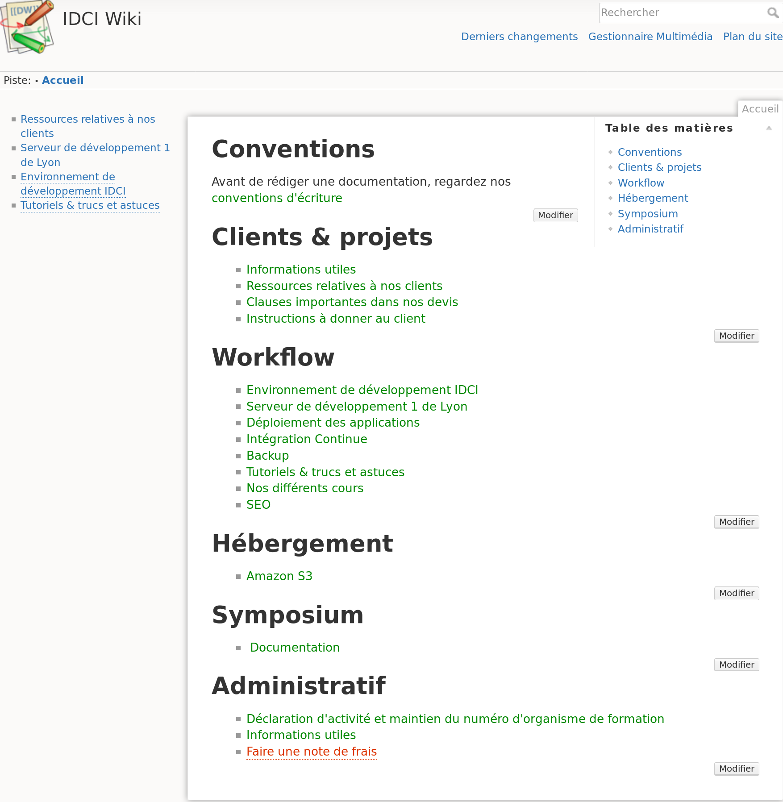
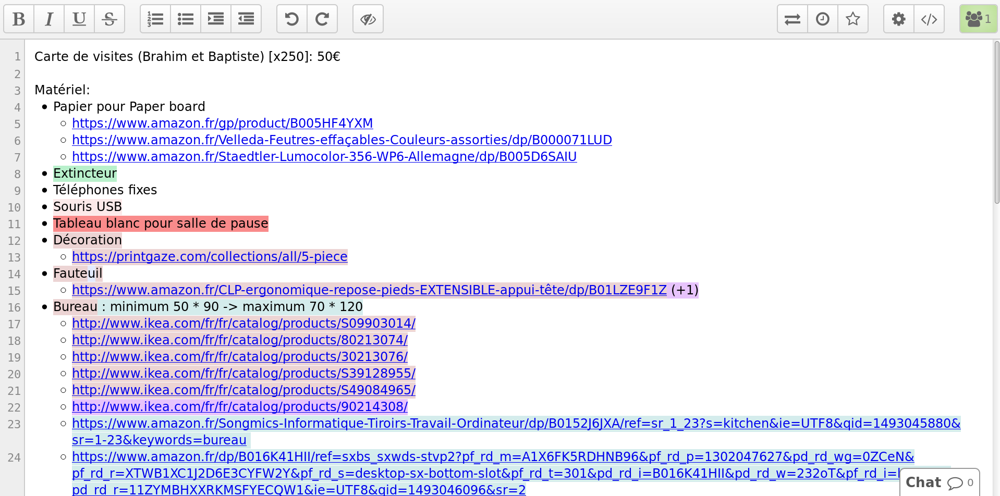

# Remerciements

Je tiens à remercier dans un premier temps, toute l'équipe pédagogique de l'IUT informatique de Bourg-en-Bresse et les intervenants professionnels de la formation METINET, pour nous avoir transmis leurs expériences.
Je tiens à remercier toute l'équipe d'IDCI-Consulting pour l'accompagnement qu'elle m'a apporté depuis déjà plus d'un an.
Je remercie plus particulièrement Brahim Boukoufallah pour sa disponibilité et l'attention qu'il m'a consacrée jusqu'à aujourd'hui, ainsi que Baptiste Bouchereau et Gabriel Bondaz pour toute l'expérience dont ils m'ont fait profiter.
Je remercie également Adrien Peytavie pour son accompagnement sur cette année METINET.

# Résumé

Un développeur full-stack maîtrise l'ensemble des domaines techniques constitutifs d'un projet informatique : administration système et hébergement, modèles de données, logique métier, interface utilisateur (avec l'aide d'un graphiste), expérience utilisateur (UX), recueil et compréhension des besoins. J'ai eu la chance d'avoir un aperçu de ce métier lors de mon implication sur les différents projets.

# Sommaire

# Introduction

## IDCI-Consulting

IDCI-Consulting est une ESN au capital de 10 000 €, créée le 10 décembre 2007 à l'initiative de Gabriel Bondaz et Frédéric Bondaz. L'activité principale consiste en la conception, le développement et le maintien de sites web s'appuyant sur des technologies open source : il s'agit généralement d'applications web PHP complexes telles que des solutions e-commerce, de la gestion d'événements, etc.
En plus du développement, IDCI-Consulting propose des formations dans le domaine du web. Cela peut être pour ses clients afin de leur permettre de prendre en main leur site, ou pour d'autres entreprises soucieuses de découvrir des technologies de pointe. Enfin, IDCI-Consulting propose aux entreprises des consultants qui apportent à ces dernières un support et des compétences d'experts.

## Environnement de travail

La SARL IDCI-Consulting est une petite structure se composant (moi inclus) de cinq collaborateurs : Gabriel Bondaz (gérant/analyste développeur), Frédéric Bondaz (gérant), Baptiste Bouchereau (gérant/analyste développeur), Brahim Boukoufallah (développeur) et Eddie Barraco (développeur).
Tous les postes de travail de la société sont sous système d'exploitation libre : Ubuntu 16.04. Tous les logiciels utilisés sont également libres et gratuits. Ceux couramment utilisés sont :

- Git : un outil de gestion de version.
- Docker : un outil permettant de créer des environnements (appelés conteneurs) isolant des applications.
- Gimp : un logiciel de graphisme et retouche d'images.
- Dia : un logiciel de création de schéma.
- Umbrello : un logiciel permettant la création de diagrammes UML.
- LibreOffice : un logiciel permettant de créer des documents de tous types : .doc, .pdf...
- Chromium, Firefox : navigateurs web performants.
- Vim, Gedit : éditeurs de texte.

IDCI-Consulting dispose d'un serveur de développement et propose aussi des outils de travail en
équipe :

### Un outil d'hébergement et de gestion de développement logiciels :

Aujourd'hui, une très grande majorité des codes open source sont hébergés sur Github, et sont disponibles via Git. C'est l'outil que nous avons utilisé majoritairement ces dernières années. Cependant, le code source n'est donc pas hébergé sur nos serveurs, mais sur les serveurs de Github. C'est pourquoi IDCI-Consulting a mis à disposition un service similaire à Github : Gitlab. A contrario, Gitlab nous permet de privatiser certains codes sources.

### Un outil de gestion de projets :

Dans les services informatiques, les demandes de mise à jour, d'évolution de logiciel et les reports de bogue de la part des clients sont des choses très fréquentes. Pour éviter de fonctionner par mail et de se perdre dans une multitude d'informations, il est préférable d'utiliser des outils de gestion de projets.

IDCI-Consulting met à disposition Redmine qui joue parfaitement ce rôle. Le client ajoute un ticket, c'est-à-dire une demande qui peut être traitée en fonction de son état d'urgence, de l'échéance, etc.

### Une plate-forme de stockage

Le stockage en ligne « Cloud » est devenu un moyen connu pour gérer nos fichiers numériques. Nous sommes de plus en plus jongleurs entre les appareils, que ce soit un ordinateur portable ou de bureau.

IDCI-Consulting propose un service : Owncloud. Cela signifie que nous avons la possibilité de mettre à disposition nos fichiers dans le Cloud n'importe quand, n'importe où et comme nous le voulons.

### Un Wiki

Un wiki est un outil de travail collaboratif. C'est un site web librement modifiable par ses visiteurs, sans difficultés techniques, et qui permet la libre circulation de l'information au sein de l'entreprise.

Chez IDCI-Consulting, nous utilisons DokuWiki. La particularité de celui-ci est qu'il ne nécessite pas de base de données (toutes les données sont stockées dans des fichiers texte).

### Un Pad

Le Pad est un outil d'édition de texte en direct et collaboratif. Il permet une prise de note groupé ainsi que le partage d'information légère simple et non protégé.

## Mon rôle

J'interviens au sein de la société de manière polyvalente. Mes tâches vont du développement d'outil internes à l'élaboration d'applications web client à forte plus-value, bien plus complexes, nécessitant un travail d'équipe et des connaissances techniques sur lesquelles je monte en compétence. Je travaille principalement sur les technologies du web, à savoir PHP, JavaScript, HTML et CSS. J'utilise les frameworks Symfony et VueJs.

# Les projets pour lesquels j'ai développés

## Optedif
### Reprise du stage

- Historique du projet

J'avais précédemment travaillé sur le projet Optedif lors de mon stage de fin de DUT il y a un an. Au début de cette année de Licence Professionnelle, Optedif constituais encore une grosse partie de mes développements au sein d'IDCI-Consulting.

### Accompagnement vers la passation

En fin d'année 2016, IDCI-Consulting à exprimé sont besoin de ne plus maintenir le site Optedif. Notre client à donc trouvé un nouveau collaborateur pour développer son projet. IDCI-Consulting à été missionné pour simplifier la passation, répondre aux différentes interrogations ainsi que de migrer le code source vers une nouvelle plateforme.

Le code source était précédemment hébergé sur BitBucket et il a été migré sur un GitLab mis en place spécialement pour ce projet. La structure git du projet en elle même à également été revue. Avant nous utilisions un ensemble de branche pour différencier les codes prod, pre-prod et dev. Il a finalement été décidé de passer à une structure plus simple basée sur deux branches master et dev. La modification de cette structure était à tester, vérifier et réaliser sur un repository de test pour s'assurer de l'intégrité du projet.

## Upsters

Upsters est une plateforme internet gratuite, permettant aux entrepreneurs d'être mis en relation avec des ressources dont ils auront besoin pour porter la création de leur(s) projet(s).
Ce projet est issu de l'initiative de Ludovic Rerolle et de Julie Borgeot.

### Reprise du projet

Le site Upsters a été commencé par un précédent développeur indépendant qui débutait sur le framework Symfony. Ce travailleur indépendant à abandonné le développement pour raison personnelle. Ainsi le client Dozee s'est mis en quête d'une équipe de développeur pour porter le projet à son terme. La reprise du projet à donc commencé par une analyse du projet ainsi que du diagnostic de l'état du code.

- État non terminé

### État actuel du projet

- Projet répondant à l'appel d'offre de Lyon French Tech

En juillet 2017, La Lyon French Tech a émis un appel d'offre concernant une application de mise en relation de professionnel correspondant beaucoup au projet Upsters. Dozee à donc émis une réponse à cet appel d'offre. Dozee espérait obtenir un partenariat avec IDCI-Consulting et ainsi s'assurer une équipe de développeur pour l'accompagner dans sa démarche. Nous avons été amenés, faute de ressource disponible, à décliner cette demande. Dozee a donc cherché de nouveaux collaborateurs pour poursuivre le projet.

# L'analyse du projet Inflexyon

Inflexyon est une entreprise Lyonnaise qui propose un ensemble de service autour de cultures française et étrangères. Elle propose par exemple des cours de langue, des ateliers de type variés, un centre de d'examen, des aides au logement et d'autres choses.
Inflexyon existe depuis près de 10 ans et a vu son besoin d'un système d'information complexe augmenter progressivement. IDCI-Consulting a été sollicité pour apporter son analyse du SI actuel et pour exprimer un ensemble de proposition dans le but de l'améliorer. L'idée sous-jacente est que si nos propositions d'améliorations ainsi que notre estimation de leurs coûts correspond aux attentes d'Inflexyon, IDCI-Consulting serait engagé pour réaliser ces développements.

Notre intervention s'est déroulé en trois étapes :

- Une étape d'entretien avec un ensemble de personne travaillant chez Inflexyon dans le but d'obtenir un ensemble d'information concernant leurs métiers et pour mieux cerner leurs différents besoins.
- Une étape de rédaction d'un document comprenant un récapitulatif de nos pistes d'amélioration ainsi qu'un devisage de nos coûts pour les réaliser.
- Une présentation devant leurs équipes du projet global.

Gabriel Bondaz et moi-même avons conduit Inflexyon à la réflexion de son SI au cours de ces différentes étapes. Notre objectif était d'apporter un ou un ensemble d'outil permettant d'aider Inflexyon dans son développement d'offre toujours plus variées. Il y a également eu un besoin d'unifier les différents services pour simplifier le suivit des différents process.

## Entretiens chez Inflexyon

Nous avons dont tout d'abord sollicité certains membres de l'équipe d'Inflexyon pour obtenir un ensemble d'information concernant leurs différents métiers et pour mieux cerner leurs besoins. Nous avons donc passé des entretiens avec des personnes en charge du fonctionnement de l'entreprise. Nous avons passé 2 jours dans les locaux d'Inflexyon à échanger avec l'équipe autour de pistes d'amélioration.

Le SI en œuvre à cette époque fonctionnait comme suit :

- Chacun des services d'Inflexyon est manager par des personnes différentes et avec des méthodes différentes. Ce découpage des services est historique car avant ce besoin d'unifier, c'est bien un ensemble d'offre qui coexistant dans l'ensemble Inflexyon.
- Le stockage des données (client, offres, services, logements, examens) est effectué dans des tableurs Google Excel variés. Cette méthode assure à chacun une persistance des données mais oblige une grande redondance en fonction des services. Les informations clients se retrouvent dans la fiche d'aide au logement, de celle des cours auquel participe l'étudiant, dans celle destiné au comptable.

Il a rapidement été convenu que la méthode actuelle ne convenait plus à la bonne croissance et ce pour plusieurs raisons :

- Difficulté de suivi global des process
- Analyse de l'état de santé d'Inflexyon impossible
- Impossibilité de partage le travail cas chaque donnée est individualisé par les travailleurs
- Impossibilité de faire le suivit d'un client au travers plus d'un service car la donnée n'est pas mutualisé.

## Phase d'analyse et de conception interne

Pour répondre aux problématiques exprimées nous avons rapidement proposé que nous partions directement sur l'idée de développer un nouvel outil globalisant les différents services d'Inflexyon.

Dans cet objectif d'unification nous avons commencés par redéfinir ensemble le vocabulaire auquel nous aurons à nous cantonner.

## Présentation devant les équipes Inflexyon

